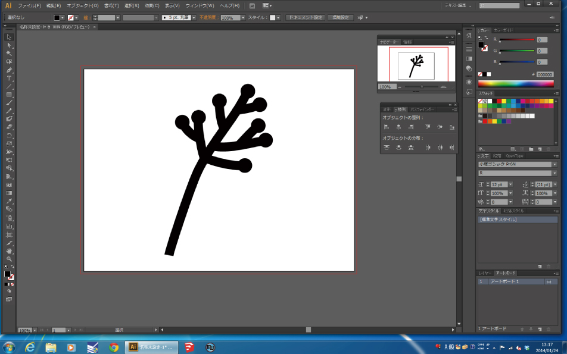
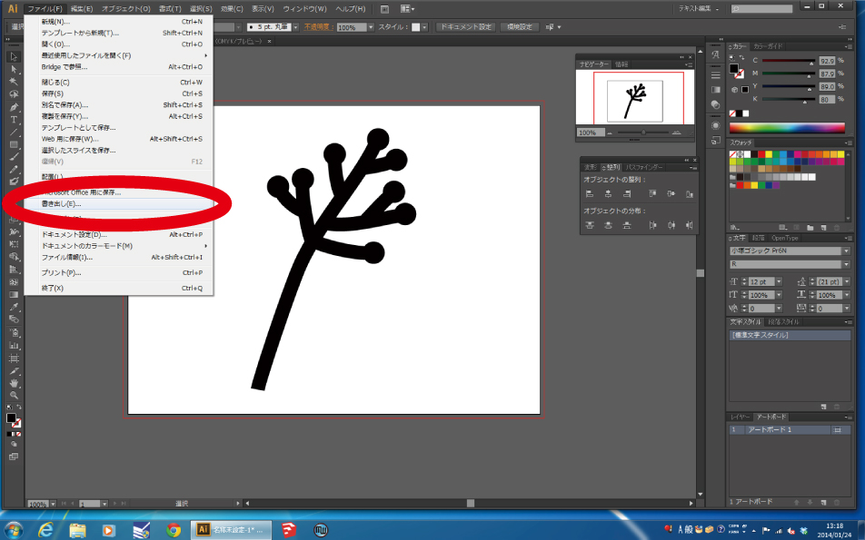
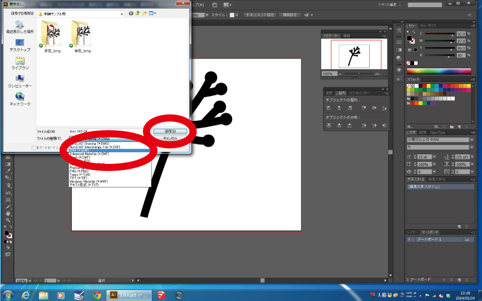
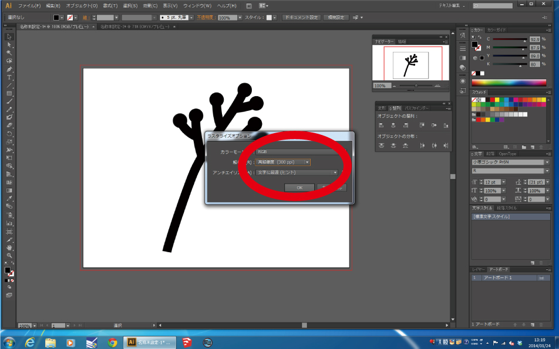
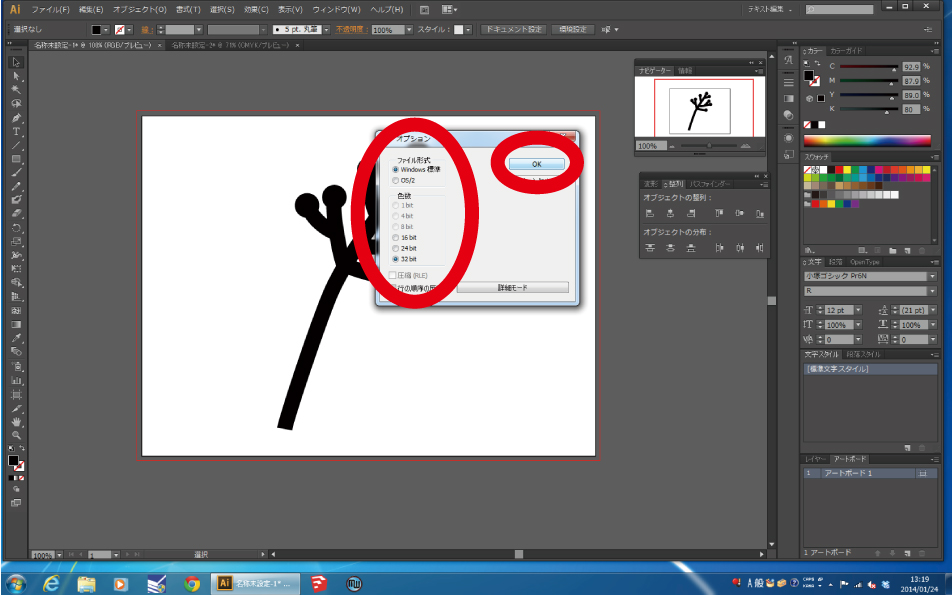
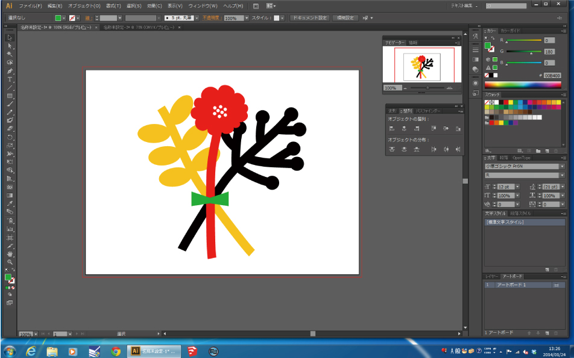

# 01-1. Adobe Illustrator データを使う場合
  

 
 

**カラーモードRGB**でIllustratorデータを作成します。 
このとき、**画像のサイズを刺繍サイズの3〜5倍くらいの大きさ**にしておくと、 
刺繍ミシン用ソフトウェアへのデータ読み込み時の精度が上がります。 
（ただし大きくするほどデータサイズも重くなるので注意！） 
 
 
 

 
 

**“ファイル”** ＞ **“書き出し”** を選択します。 
 
 
 

 
 

**“ファイルの種類”** から **“BMP(.bmp)”** を選択し、**保存**をクリックします。 
 
 
 

 
 

**“ラスタライズオプション”**が表示されたら **“カラーモード：RGB”**、 
**“解像度：高解像度（300ppi）”** を選択し **「OK」** をクリックします。 
 
 
 

 
 

**“BMPオプション”**が表示されたら **“ファイル形式：Windows標準”**、 
**“色数：32bit”** を選択し **「OK」** をクリックします。これで完成です。 
 
 
 

 
 

多色のデータを作成するときは、実際に使用する糸の色に関係なく、 
左の画像のようにパーツ毎明確に異なる色を使ってください。 
（白色は画像として読み込まれないので、刺繍したい箇所は白以外の色を指定してください。） 
 
 
 
 
 
 
