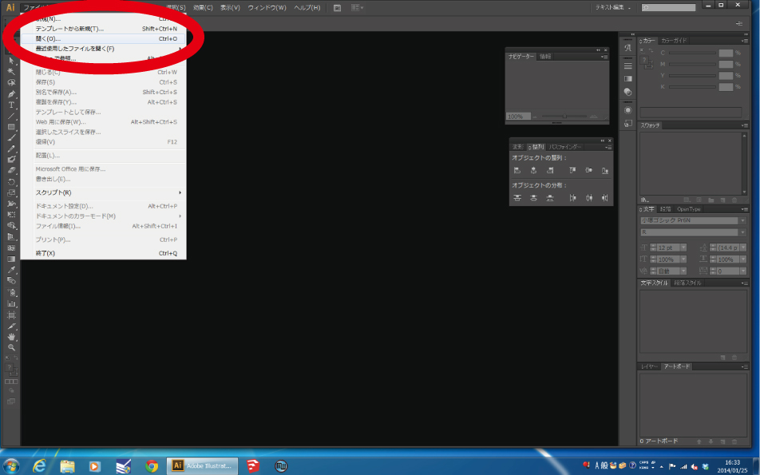
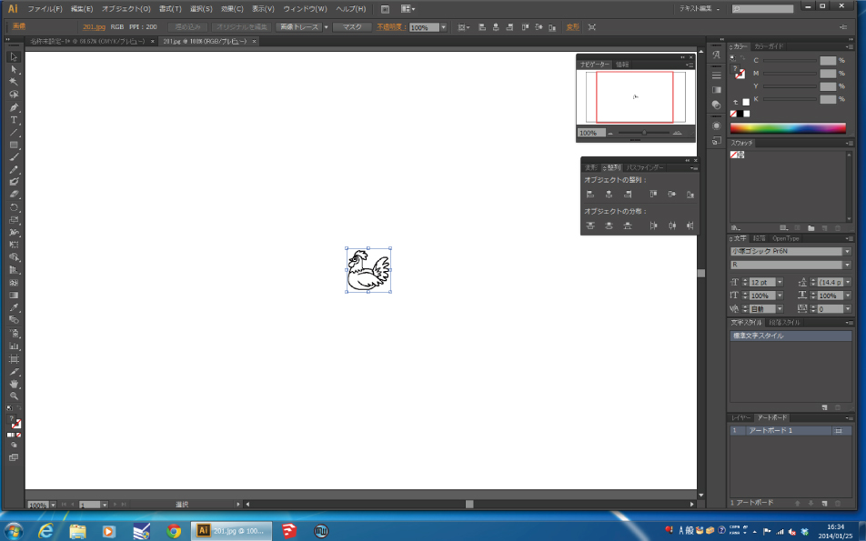
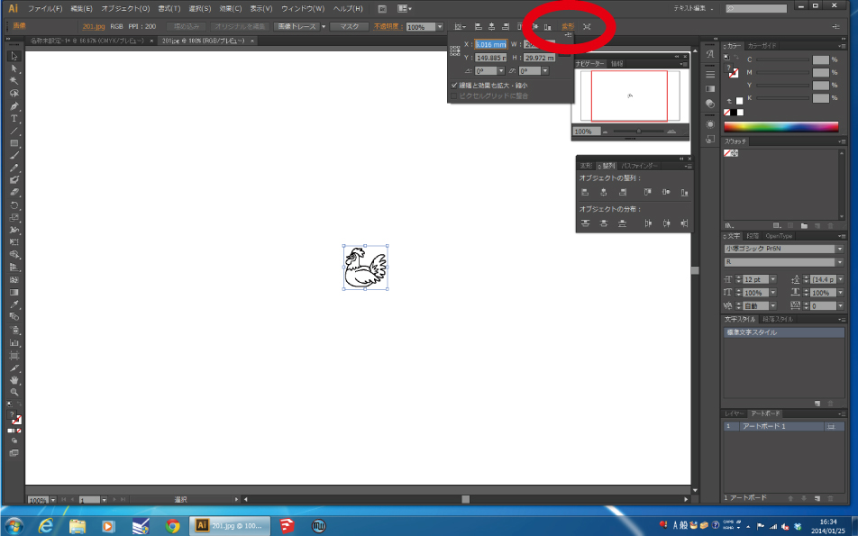
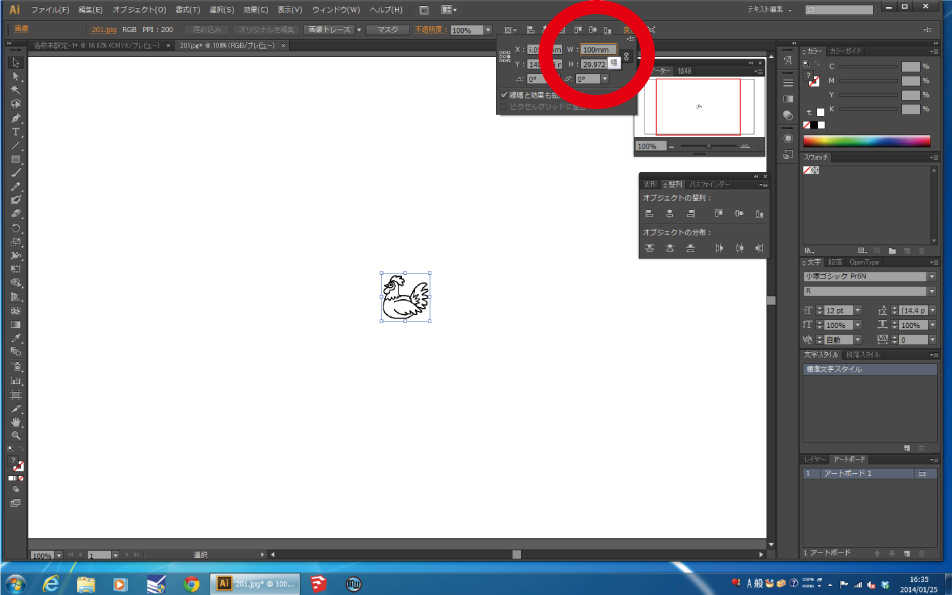
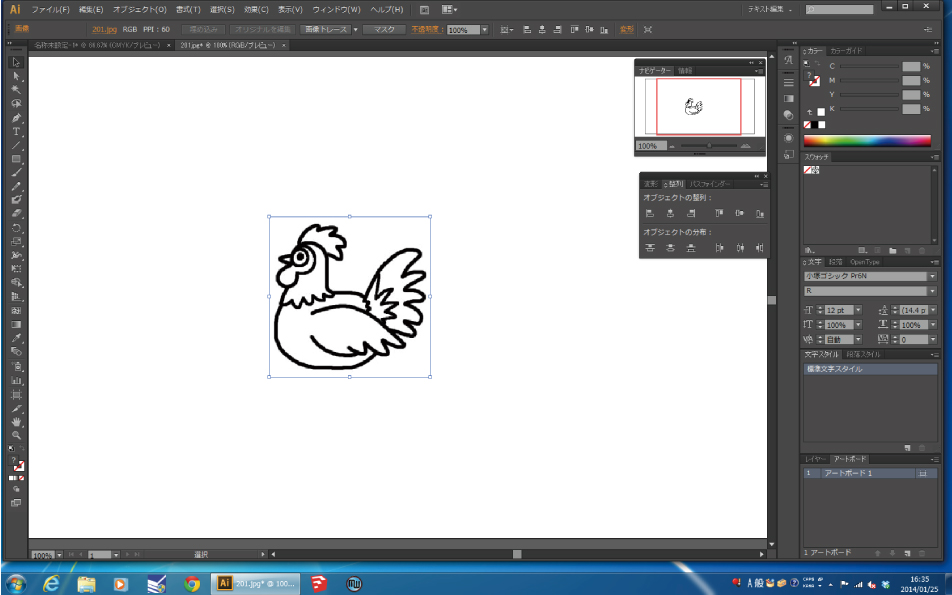

# 01-2. jpgなどの画像データを使う場合(1)
  

jpg、gif、pngなどの画像データを、Adobe Illustratorを使ってBMPデータに変換し、 
刺繍ミシン用ソフト「刺しゅうプリンター」に取り込む方法です。 
 
 
 

 
 

**“ファイル”** ＞ **“開く”** を選択し、使用する画像データを開きます。 
 
 
 

 
 

画像が開かれたら、**左クリック**で選択します。 
 
 
 

 
 

画像を選択したまま、画面右上の**“変形”**を押します。 
 
 
 

 
 

選択した画像が、刺繍サイズの3〜5倍くらいの大きさになるよう数値を入力します。 
（“W”は幅、“H”は高さを表しています。） 
 
 
 

 
 

数値の入力が完了したら**“Enterキー”**を押します。 
その後のBMPデータへの書き出しは、 
[01-1.Adobe Illustrator データを使う場合](/01-1-img.md)と同様に行ないます。 
 
 
 
 
 
 
