# 01-3. jpgなどの画像データを使う場合(2)
  

jpg、gif、pngなどの画像データを、Adobe Illustratorのトレース機能を使って 
ベクターデータにしてからBMPデータに変換し、 
刺繍ミシン用ソフト「刺しゅうプリンター」に取り込む方法です。多色刺繍向きです。 
 
 
 

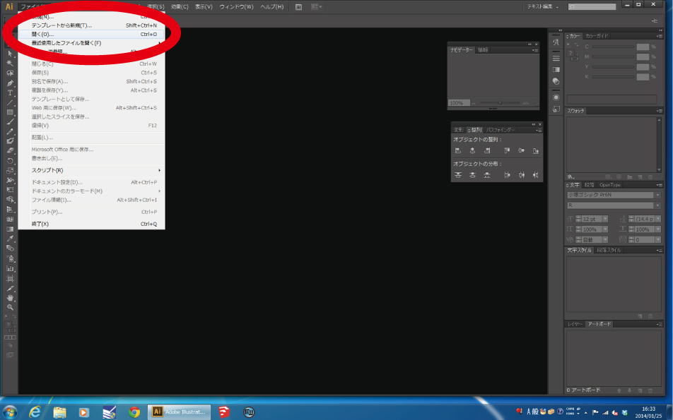 
 

**“ファイル”** ＞ **“開く”** を選択し、使用する画像データを開きます。 
 
 
 

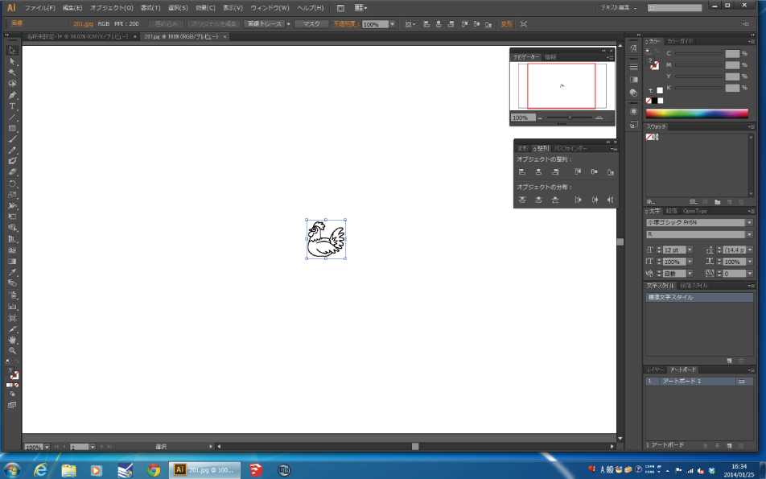 
 

画像が開かれたら、**左クリック**で選択します。 
 
 
 

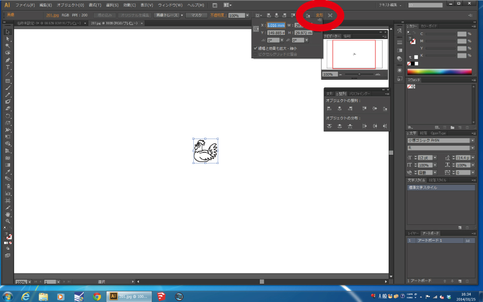 
 

画像を選択したまま、画面右上の**“変形”**を押します。 
 
 
 

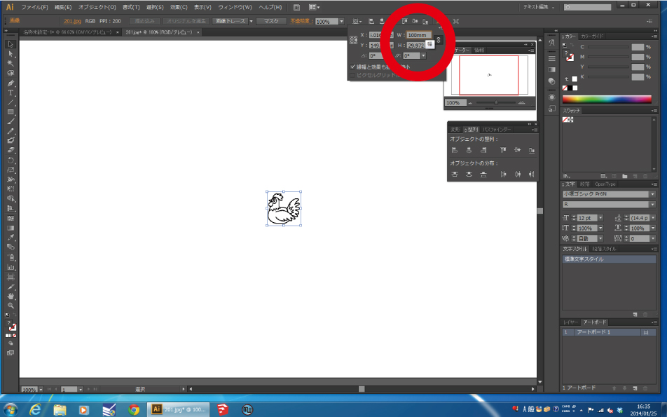 
 

選択した画像が、刺繍サイズの3〜5倍くらいの大きさになるよう数値を入力します。 
（“W”は幅、“H”は高さを表しています。） 
 
 
 

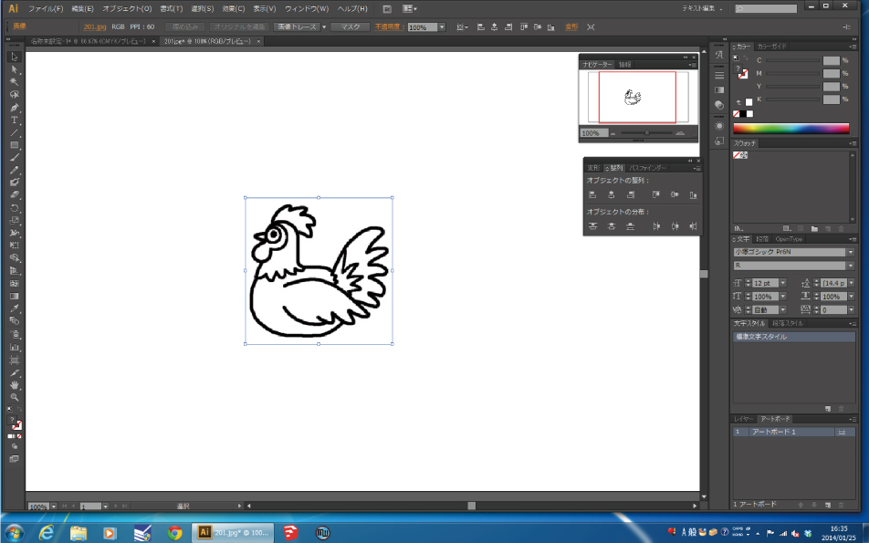 
 

数値の入力が完了したら**“Enterキー”**を押します。 
 
 
 

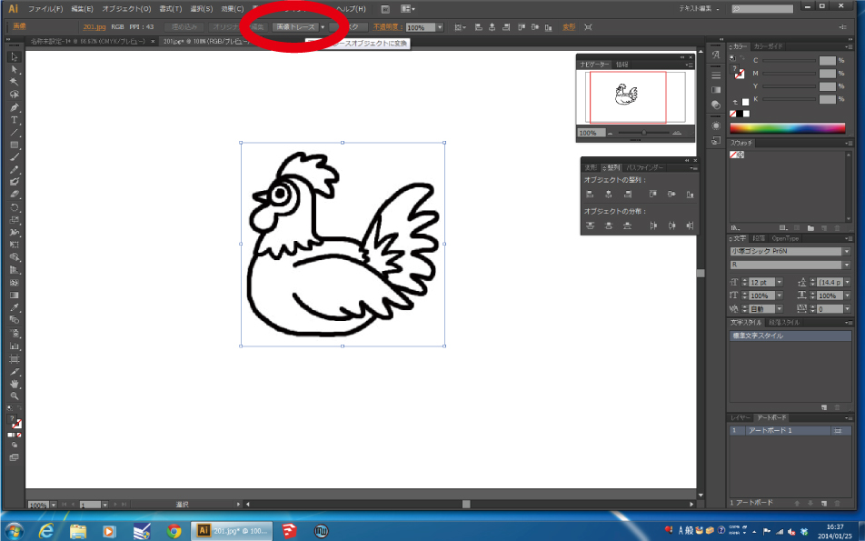 
 

画像を選択したまま**「画像トレース」**を押します。 
 
 
 

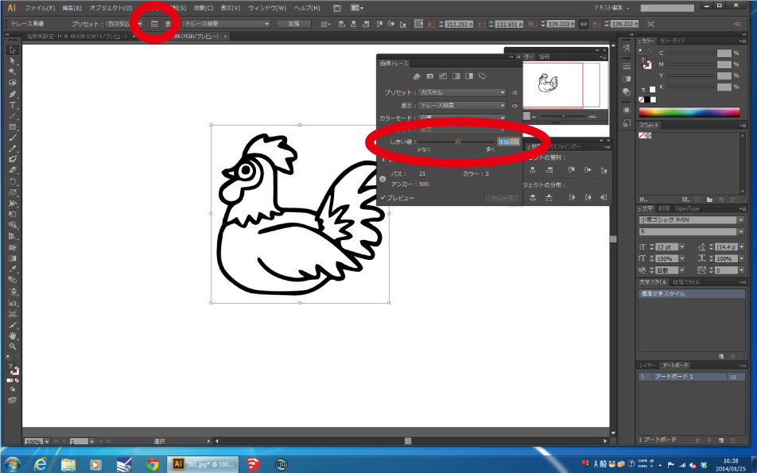 
 

**“画像トレースオプション”** を押すと **“画像トレースパネル”** が 
表示されるので **“しきい値”** のバーを動かして調節します。 
 
 
 

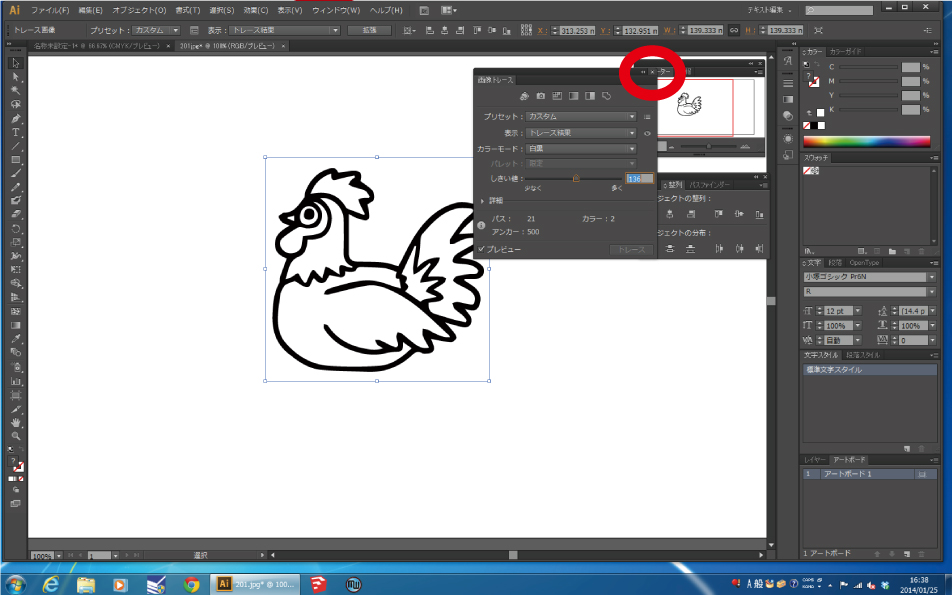 
 

調整が完了したら**“×”**を押してパネルを閉じます。 
 
 
 

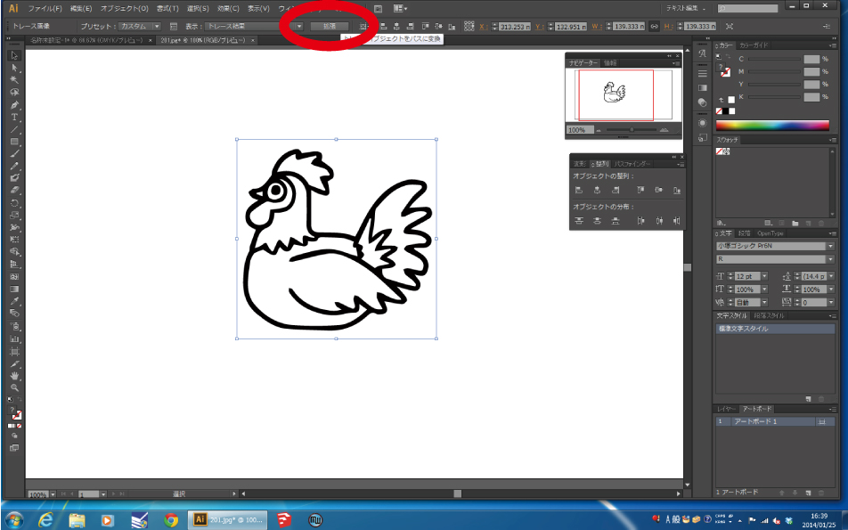 
 

**「拡張」**を押します。 
 
 
 

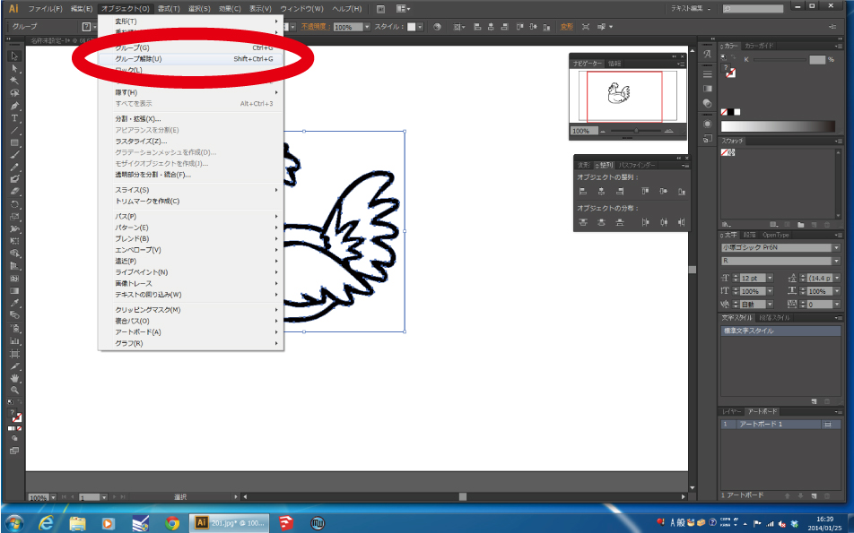 
 

**“オブジェクト”** ＞ **“グループ解除”**を選択します。 
 
 
 

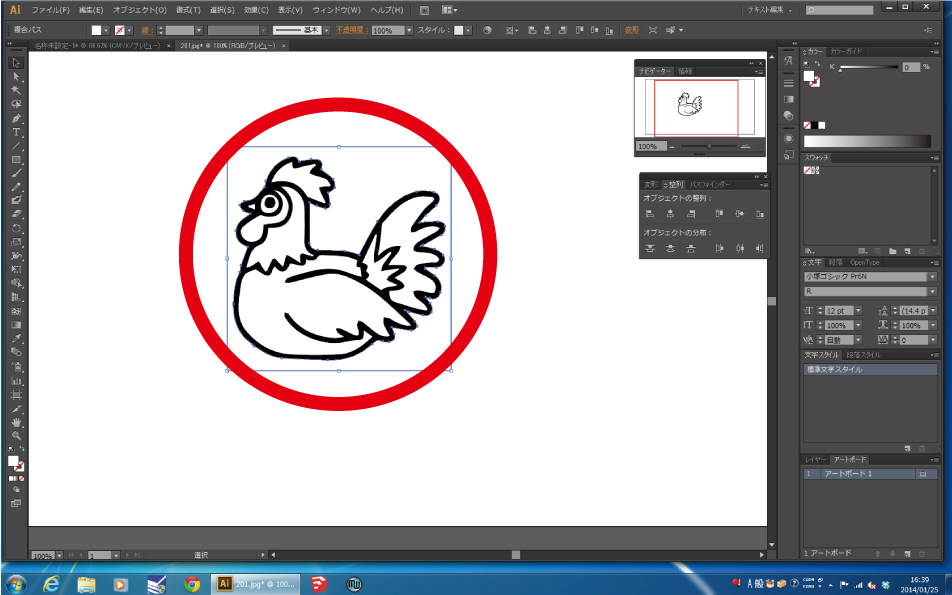 
 

トレースされた画像の余白部分をクリックします。 
 
 
 

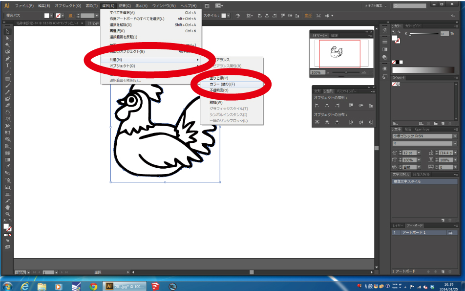 
 

余白部分を選択したまま **“選択”** ＞ **“共通”** ＞ **“カラー(塗り)”** を選択します。 
 
 
 

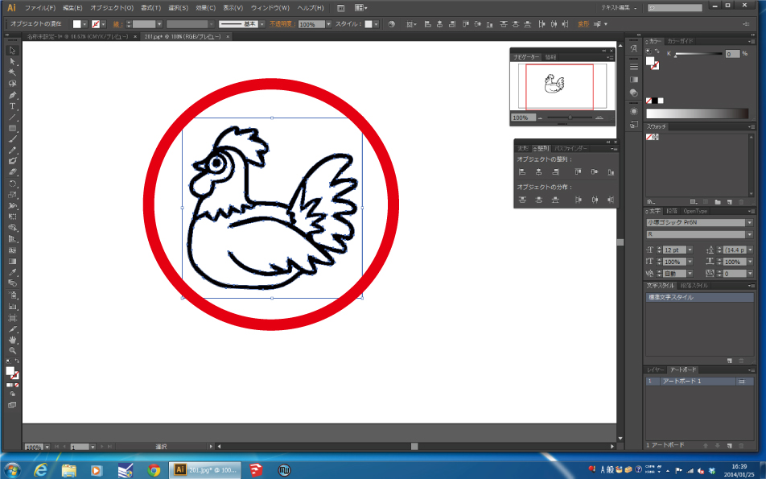 
 

画像の余白部分が全て選択されるので **“deleteキー”** で削除します。 
 
 
 

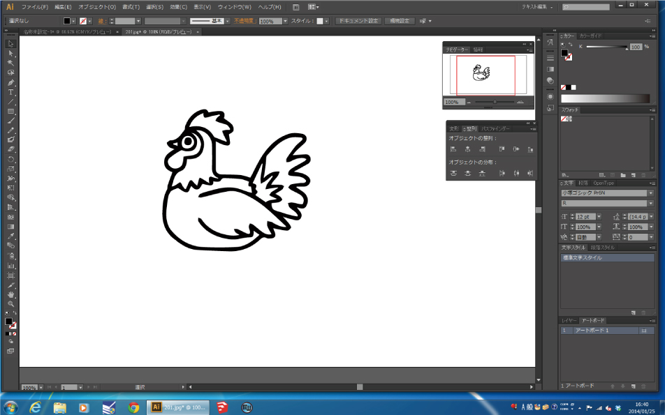 
 

これでベクターデータは完成です。 
その後のBMPデータへの書き出しは、 
[01-1.Adobe Illustrator データを使う場合](/01-1-img.md)と同様に行ないます。 
 
 
 
 
 
 
