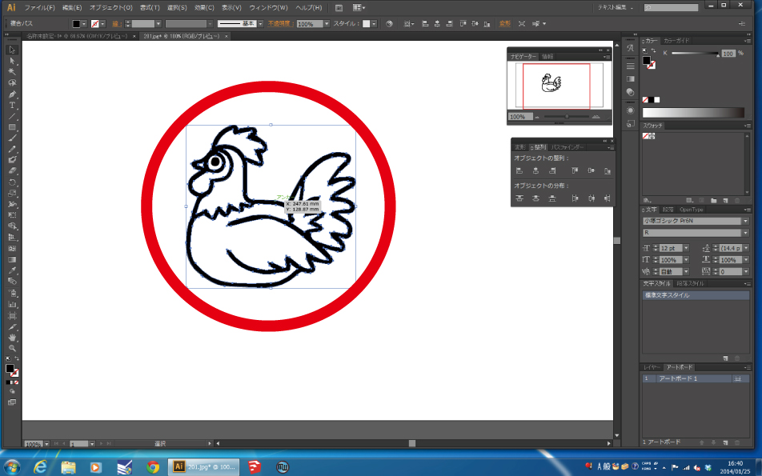
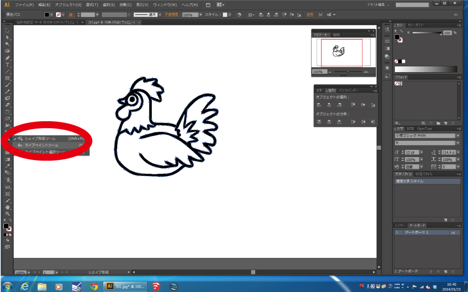
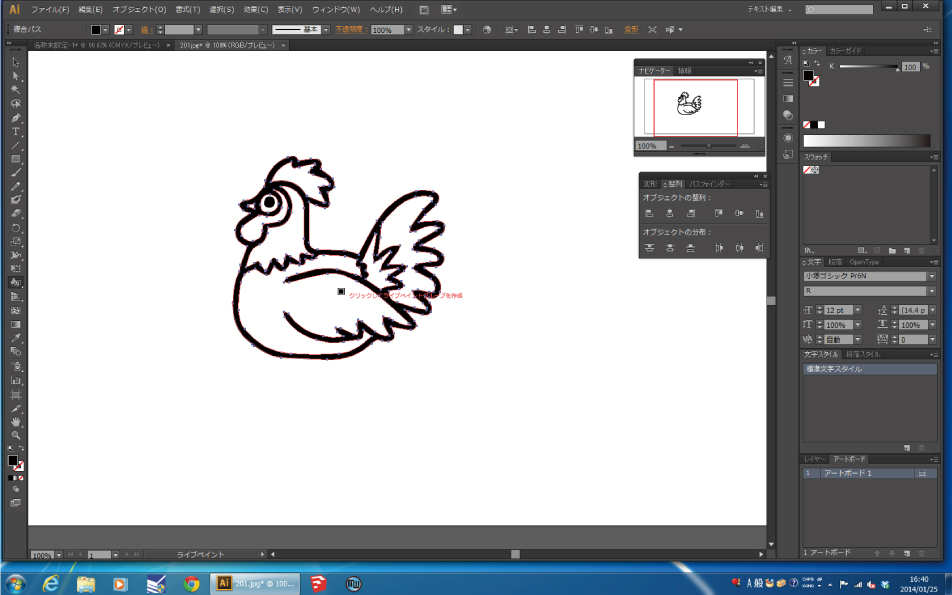
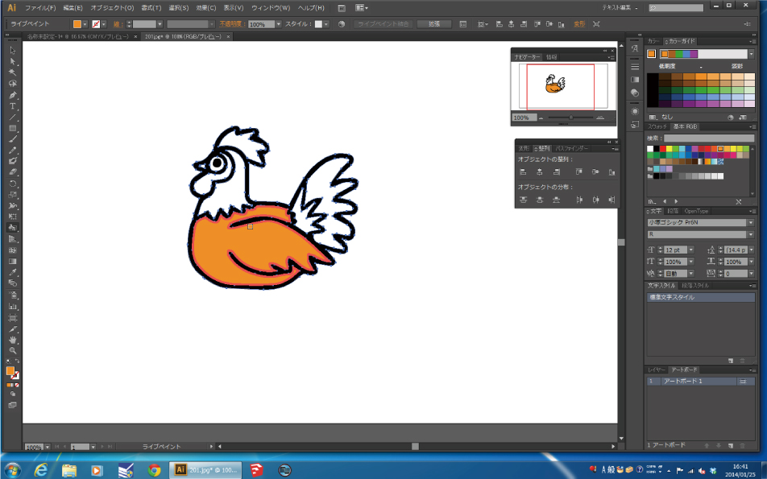
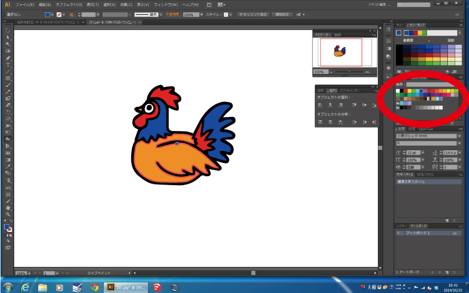

# 01-4. jpgなどの画像データを使う場合(3)
  

ベクターデータに変換した画像データに色を付ける方法です。 
多色刺繍をしたい場合、jpg等のデータをそのままBMPに変換して使用するよりも、 
ベクターデータに変換し、自分で着色をした方が綺麗な仕上がりになるのでオススメです！ 
 
 
 

 
 

トレースしたベクターデータを、**左クリック**して選択します。 
 
 
 

 
 

画面左のツールパネルから **“ライブペイントツール”** を選択します。 
 
 
 

 
 

カーソルをデータ上に合わせると、上の画像のような表示になるので、一度クリックします。 
 
 
 

 
 

そうすると枠の中が塗りつぶされます。 
 
 
 

 
 

画面右のスウォッチから好きな色を選択し、塗りつぶします。 
着色が完了したら、データは完成です。 
その後のBMPデータへの書き出しは、 
[01-1.Adobe Illustrator データを使う場合](/01-1-img.md)と同様に行ないます。 
 
 
 
 
 
 
