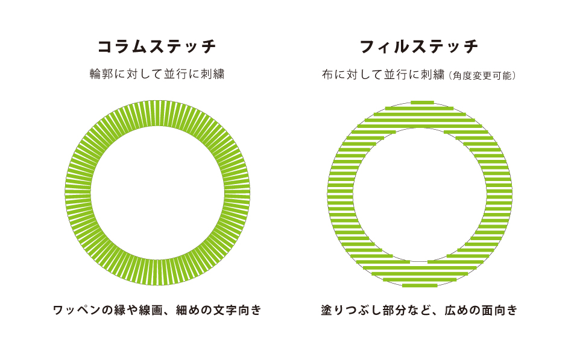
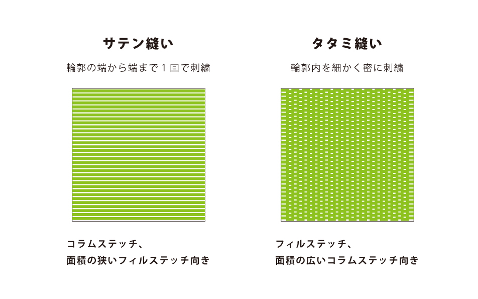
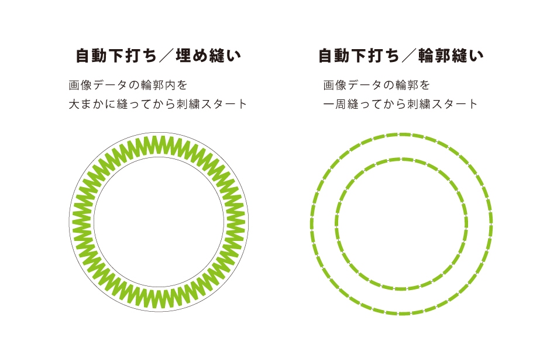

# 02-1.ステッチ、縫い方について
  

 
 

 
 

 
 

通常は、「埋め縫い」「輪郭縫い」両方にチェックを入れると綺麗に仕上がります。 
ただし、小さな模様や細い線の場合、下打ちが刺繍からはみ出してしまうことがあるので、 
一度試し縫いをした上で下打ちの有無を決めてください。 
 
 
 

## その他設定について
* フィルステッチの角度は、デフォルトでは45°になっています。（角度は変更可能です。）
* フィルステッチは、タタミのような縫い方だけでなく、様々な模様を縫い付けることができます。 
（設定方法は、次のページに記載してあります。）
* Shiftキーを押すと、ブロックを一度にいくつも選択することができます。
* **『オートパンチウィザード 5.ブロックに分ける』**の項目で、 
図柄の幅によるコラムステッチ、フィルステッチの設定ができます。

 
 
 
 
 
 
