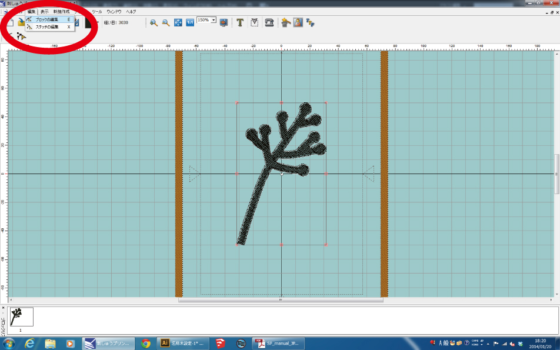
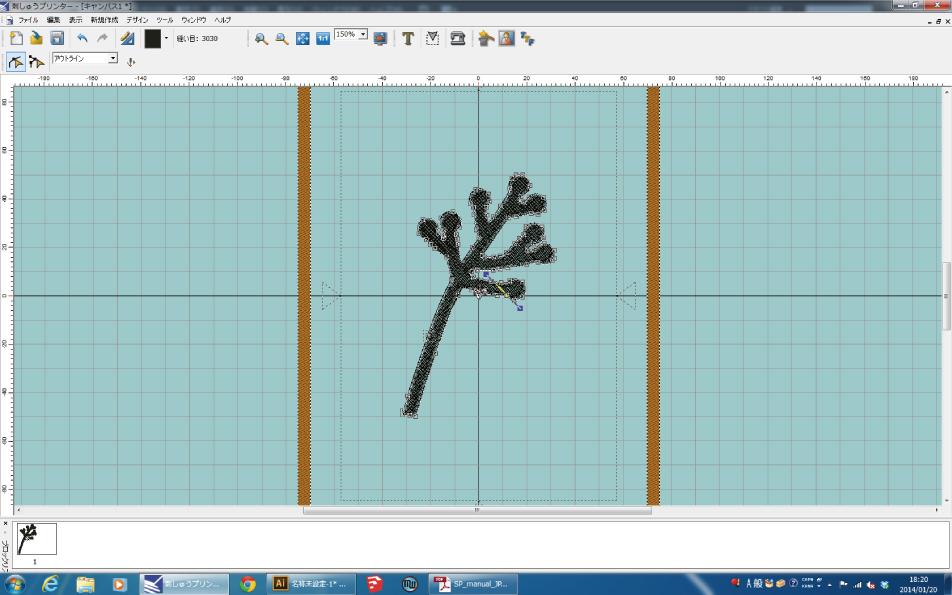
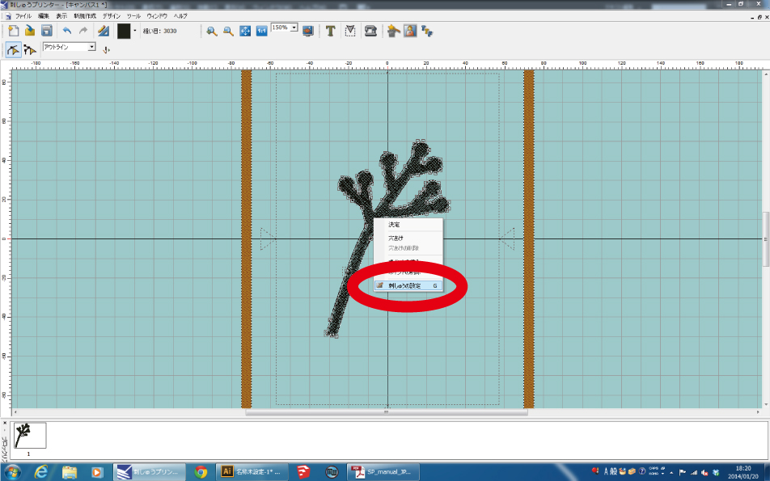
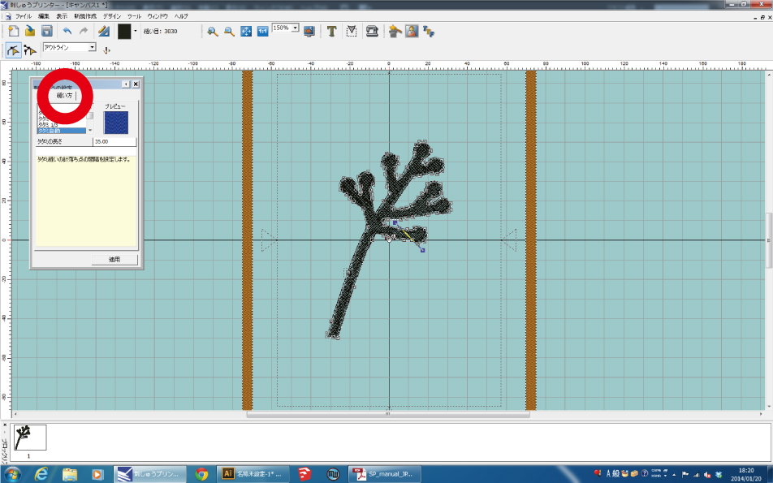
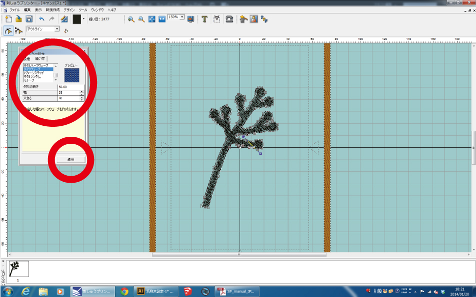
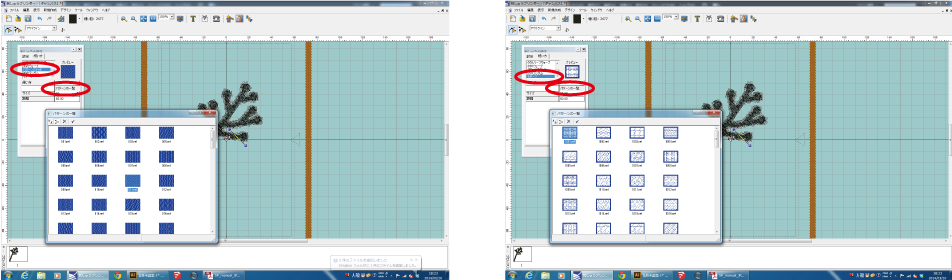

# 02-2.フィルステッチの模様の設定方法
  

※模様の設定は、画像を刺繍データに変換した後に行ないます。
   

 
 

刺繍データをクリックし**“編集”** ＞ **“ブロックの編集”**を選択します。 
 
 
 
 
 

図のようにデータが選択されます。 
 
 
 

 
 

データ上で右クリックをし**“刺しゅうの設定”**を選択します。 
 
 
 

 
 

**“刺しゅうの設定”** ウィンドウの **“縫い方”** タブをクリックします。 
 
 
 

 
 

各項目の設定をし**「適用」**を押すとデータに反映されます。 
 
 
 

 
 

ちなみに **“パターンステッチ”** と **“モチーフ”** は、 
選択するとそれぞれ**“パターン一覧”**という表示が出ます。 
そこをクリックすると模様が約100種類表示されます。 
 
 
 
 
 
 
