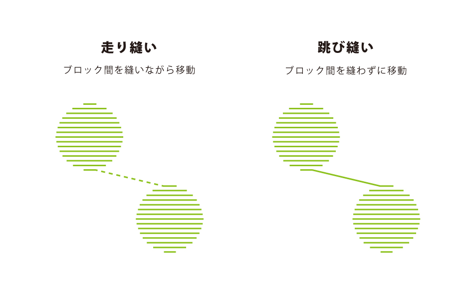

# 02-3.ブロック間の縫い方の設定方法
  

 
 

**走り縫い** 

* ブロック間の距離が広い場合向き
* 刺繍中の布縮みが発生しにくく仕上がりがきれい
* 糸の後処理に手間がかかる
* 余計な場所に穴があいてしまう

 

**跳び縫い** 

* ブロック間の距離が狭い場合向き
* 糸の後処理がラク
* 刺繍箇所にしか針が刺さらない
* 布縮みが発生し、思った位置に刺繍ができないことがある

 
 

ブロック間の距離が狭い場合「走り縫い」を選択しても 
「跳び縫い」のような仕上がりになってしまうことがあります。 
また、多色刺繍を行なう際は、糸が絡まってしまったり、 
他の色が上から刺繍されて糸が取り除けなくなる可能性があるので、 
刺繍の色を変える毎に「走り縫い」「跳び縫い」で発生した渡り糸を 
カットしたほうが綺麗に仕上がります。 
 
 
 
 
 
 
