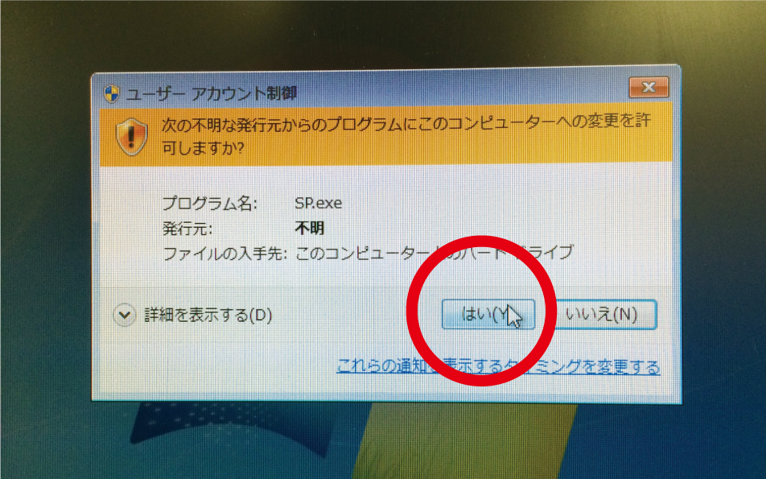
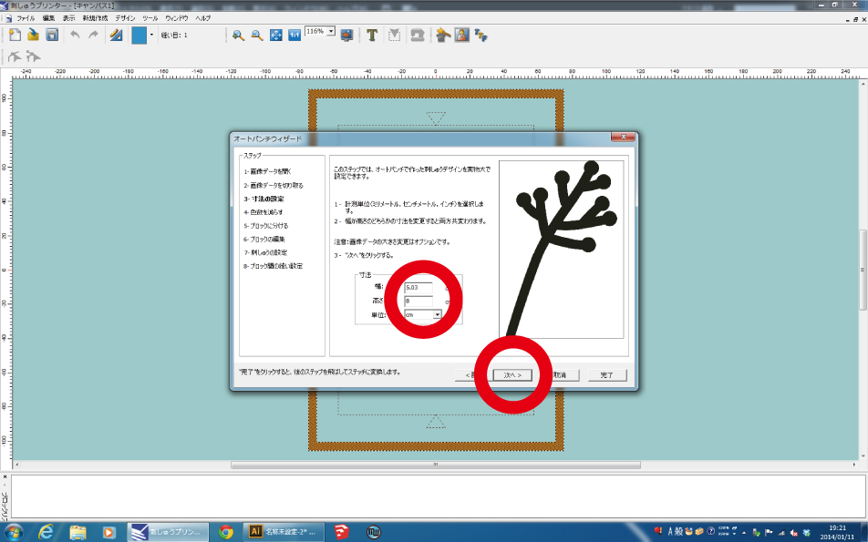

# 02.ソフトウェアのセットアップ
  

刺繍ミシン用ソフトウェアでは、様々な方法で画像データを刺繍用データに変換可能ですが、 
ここではオートパンチ機能を利用する場合の設定方法を説明します。 
 
 
 

 
 

ソフトウェアを起動させるためには、刺繍ミシンの電源を入れておく必要があります。 
パソコンとミシンが接続されているのを確認し、ミシン本体右側下の電源スイッチをオンにします。 
 
 
 

 
 

デスクトップの**“刺しゅうプリンター アドバンス”**をダブルクリックし、ソフトを起動します。 
 
 
 

 
 

写真のような警告が表示されるので**「はい」**をクリックします。 
 
 
 

 
 

**“新規作成”** から **“オートパンチ”** を選択します。 
 
 
 

 
 

オートパンチウィザードが起動したら**「次へ」**を押します。 
 
 
 

 
 

**「選択」**を押し、刺繍したい画像を開きます。 
 
 
 

 
 

画像が開かれたら**「次へ」**を押します。 
 
 
 

 
 

**「次へ」**を押します。 
 
 
 

 
 

実際に刺繍したいサイズを設定し**「次へ」**を押します。 
 
 
 

 
 

**「次へ」**をクリックします。 

>※もし設定を行いたい場合は、一度「次へ」をクリックして次のページを表示させてから、 
「戻る」をクリックして本ページを再度表示させます。 
ページ右側に表示された画像のうち刺繍したくない色があれば、 
その色を画面中央の“色の選択”欄で選択し「削除」ボタンを押します。

 
 
 

 
 

コラムステッチの幅を設定し**「次へ」**をクリックします。 
※コラムステッチ、フィルステッチとは：[02-1.ステッチ、縫い方について](/02-1-stitch.md) 
 
 
 

 
 

“背景色と同色部分を刺しゅうする”のチェックを外し**「次へ」**を押します。 
 
 
 

 
 

刺繍するブロック毎にステッチや縫い方を設定し**「次へ」**を押します。 
※ステッチ、縫い方、下打ちとは：[02-1.ステッチ、縫い方について](/02-1-stitch.md) 
 
 
 

 
 

走り縫いもしくは跳び縫いを選択し**「完了」**を押します。 
 
 
 

 
 

画像が刺繍データに変換されます。 
 
 
 

 
 

**“ツール”** ＞ **“刺しゅう枠の選択”**から、使用する刺繍枠のサイズを選択します。 
 
 
 
