# 03.上糸のセット
  

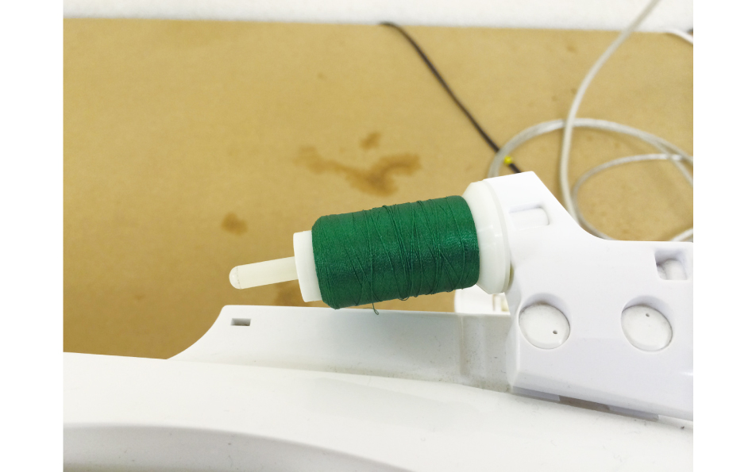 
 

上糸の糸ごまを糸立て棒に差し込みます。（またはミシン裏の糸立て棒に差し込んでください。） 
 
 
 

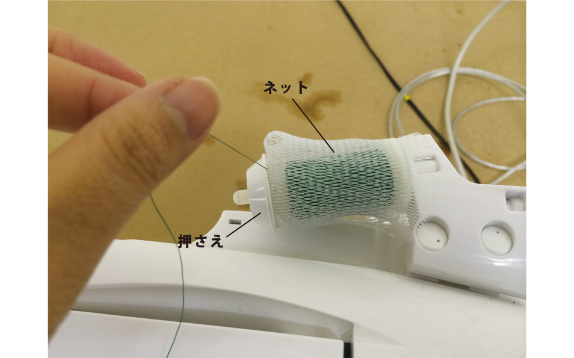 
 

糸ごまの上に（あれば）ネットをかぶせ、押さえをセットします。 
 
 
 

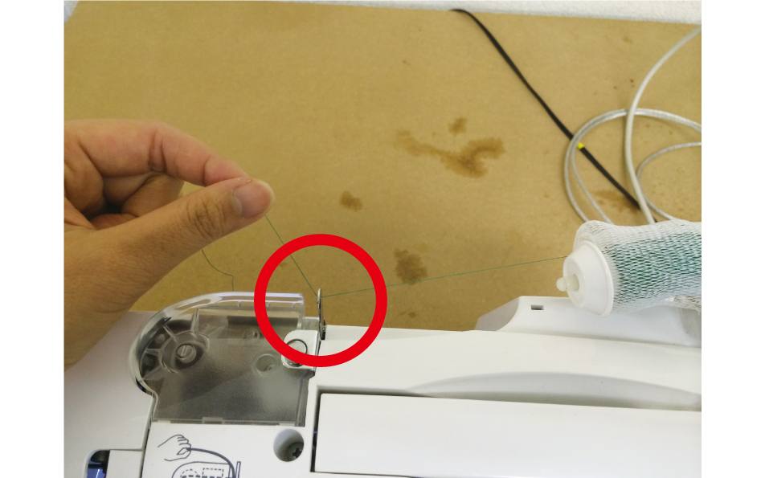 
 

フックの下を通るように糸を渡します。 
 
 
 

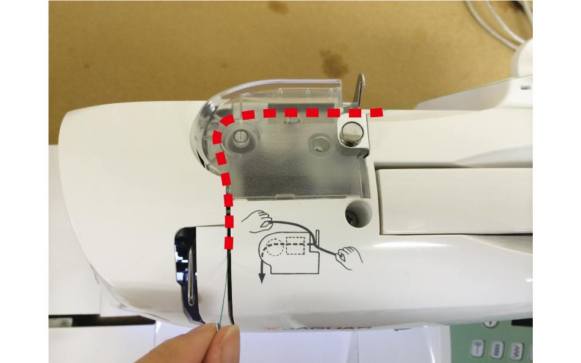 
 

上の写真のとおりになるよう、糸を手前に引っぱります。 
 
 
 

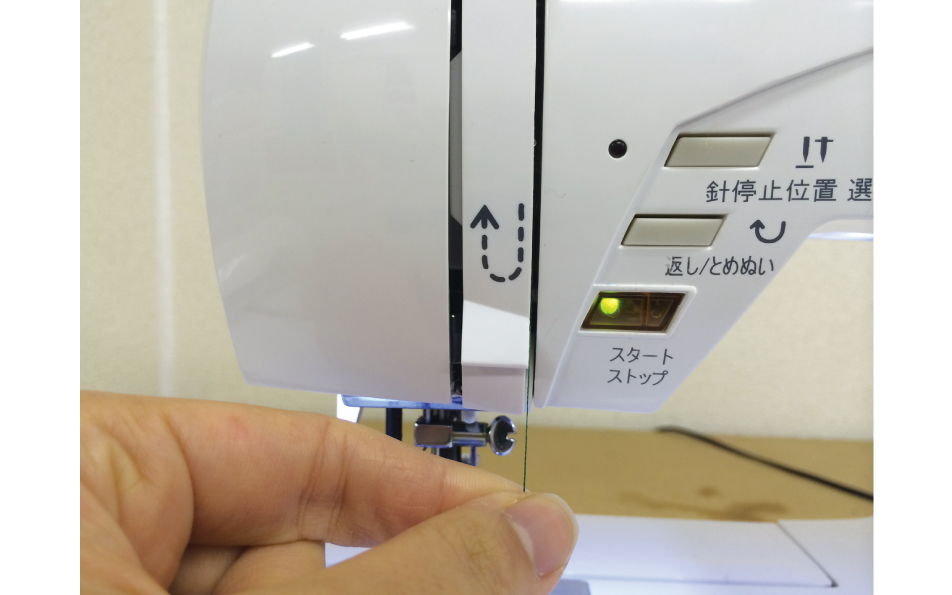 
 

溝に沿って糸を下に下ろします。 
 
 
 

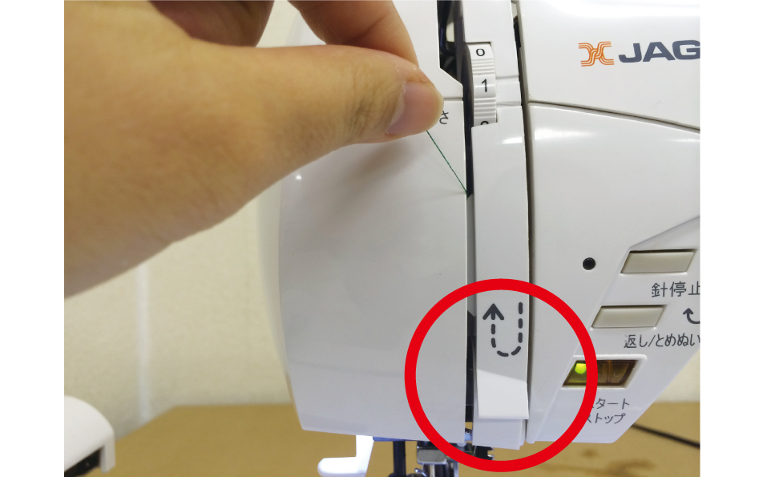 
 

Uターンさせます。 
 
 
 

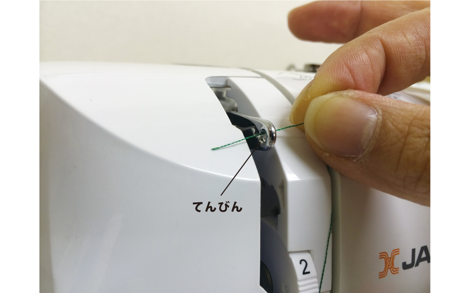 
 

てんびんの右から左に糸を通します。 
 
 
 

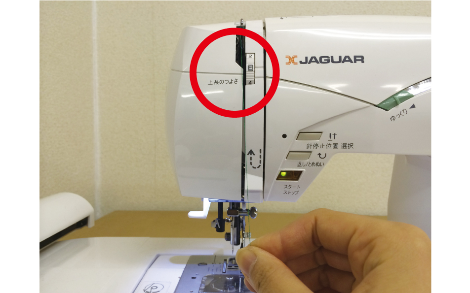 
 

溝に沿って糸を下に下ろします。このとき、上糸のつよさを**“E”**に合わせてください。 
 
 
 

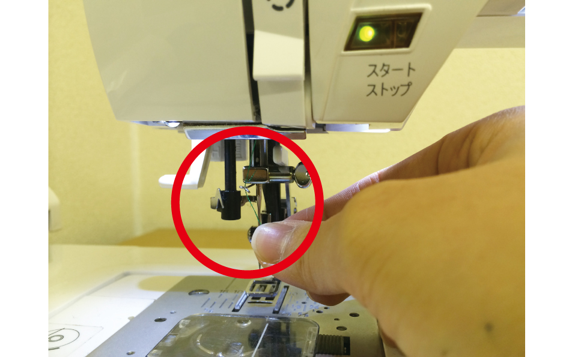 
 

そのまま糸を下げ、糸掛けにかけます。 
 
 
 

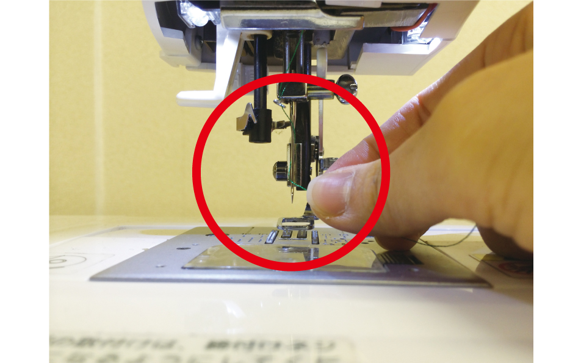 
 

糸を手前から針に一周巻き付けます。 
 
 
 

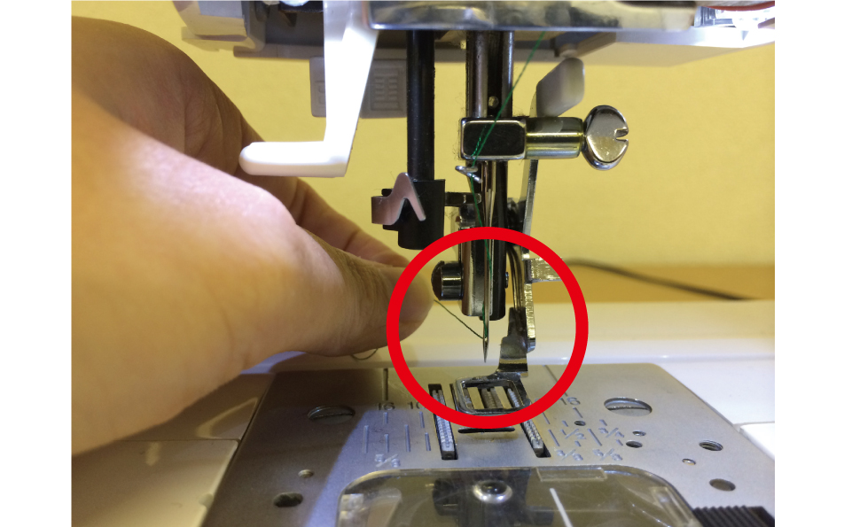 
 

針穴に糸を通します。 
 
 
 
 
 
 
