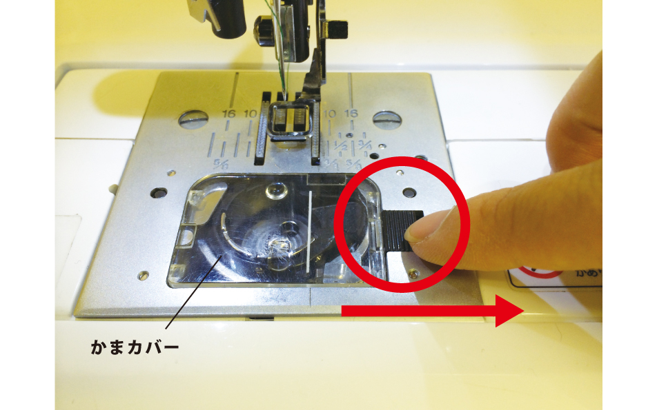
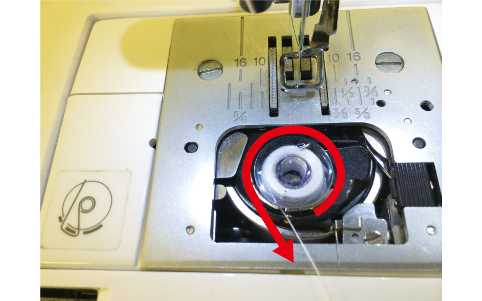
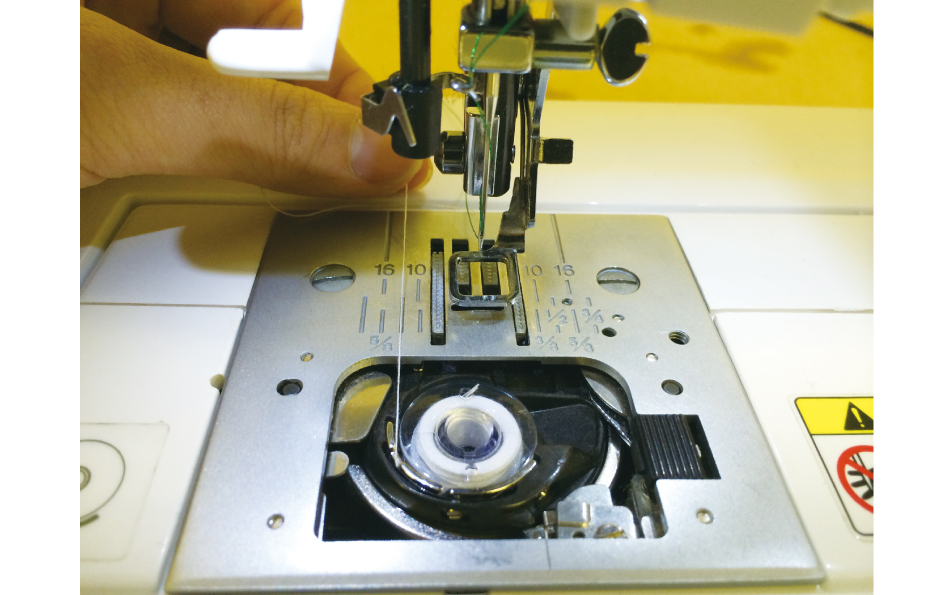
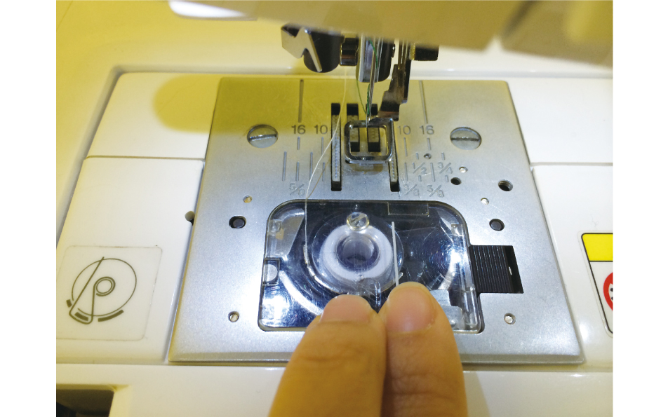
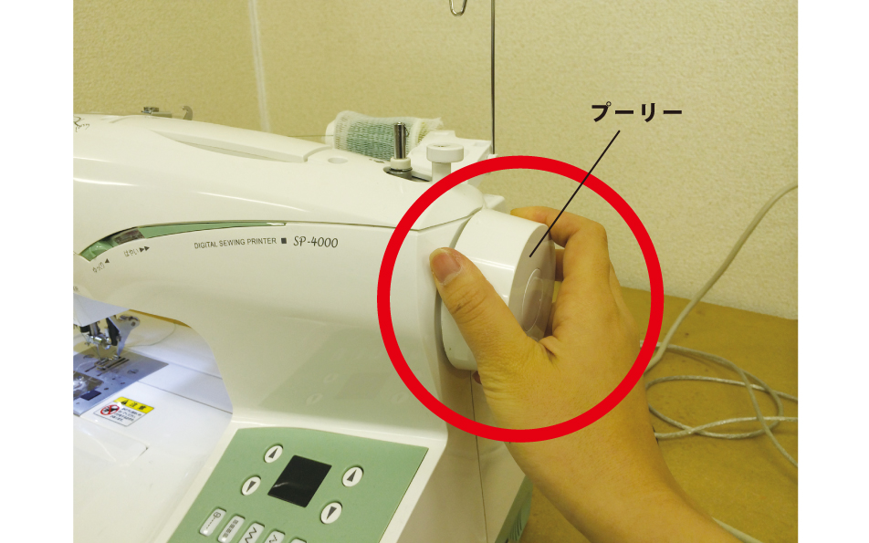
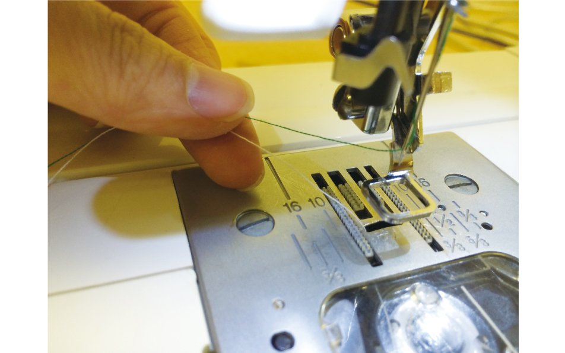

# 04.下糸のセット
  

 
 

レバーを右に引っぱり、かまカバーをはずします。 
 
 
 

 
 

糸の巻き方向が写真と同じになるようボビンをセットします。 
 
 
 

 
 

ボビンを押さえながら、糸を向こう側に引き出します。 
 
 
 

 
 

糸を10cm程度引き出したら、かまカバーを取り付けます。 
 
 
 

 
 

ミシン右側に付いているプーリーを手前に一回転させます。 
 
 
 

 
 

上糸を引っ張ると下糸が上に出てくるので、両糸を向こう側に10cm程度引き出します。 
 
 
 
 
 
 
