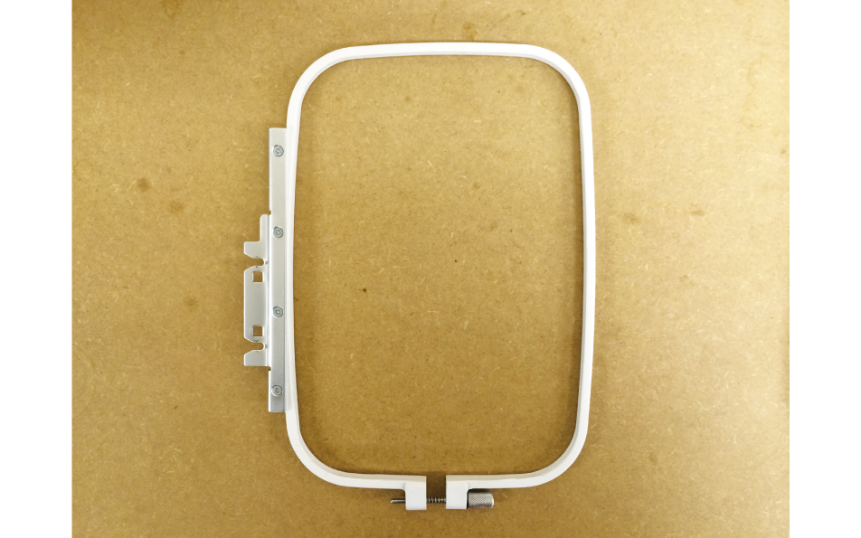
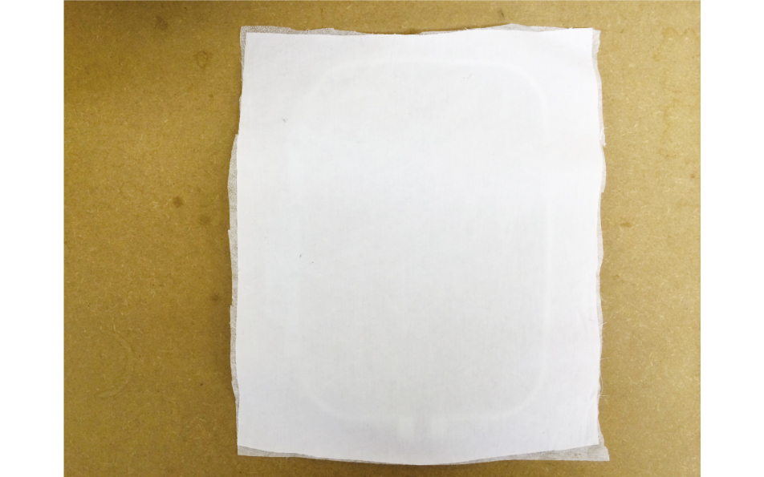
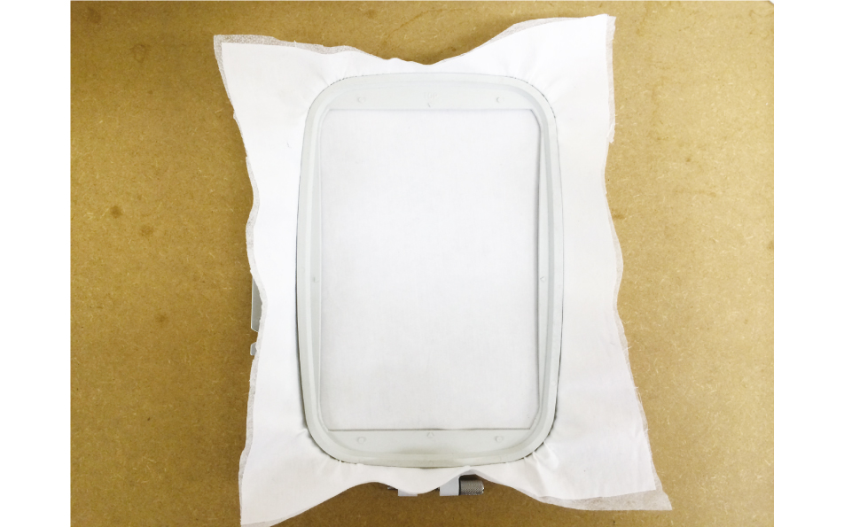
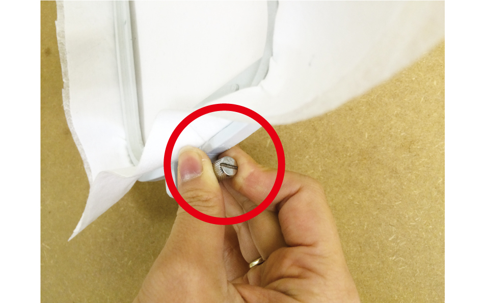
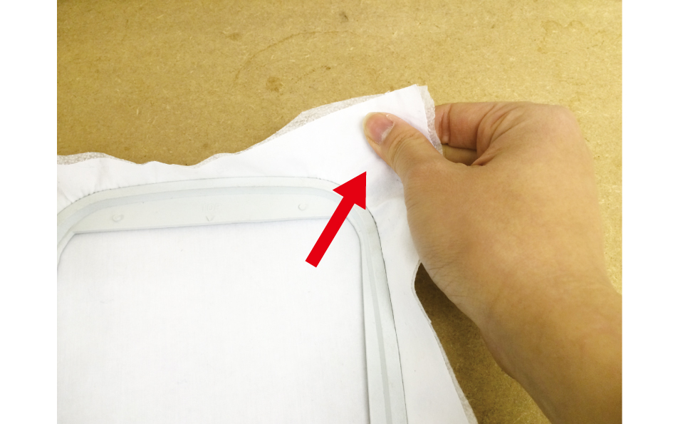
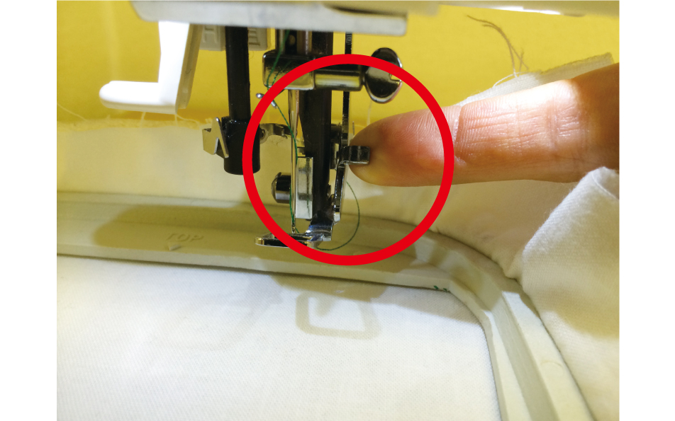
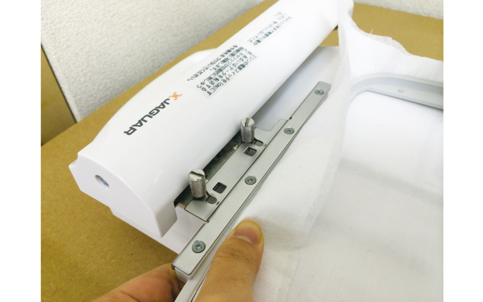
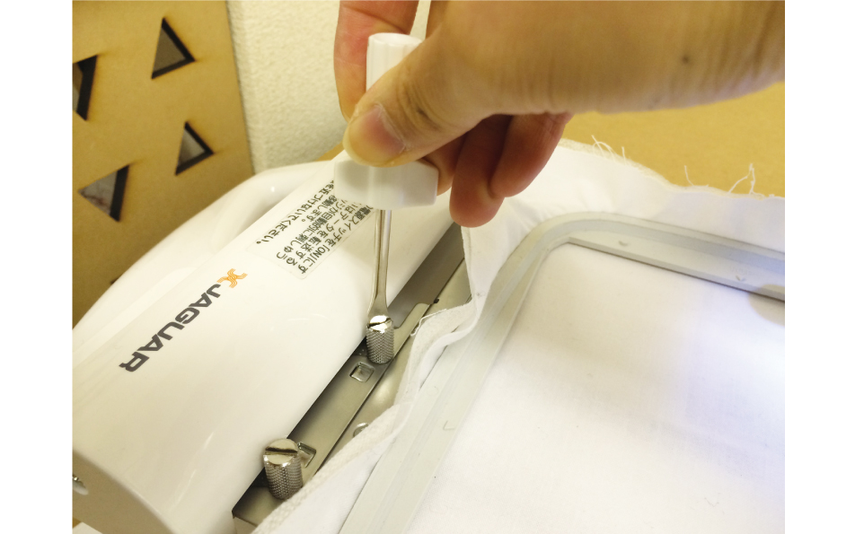
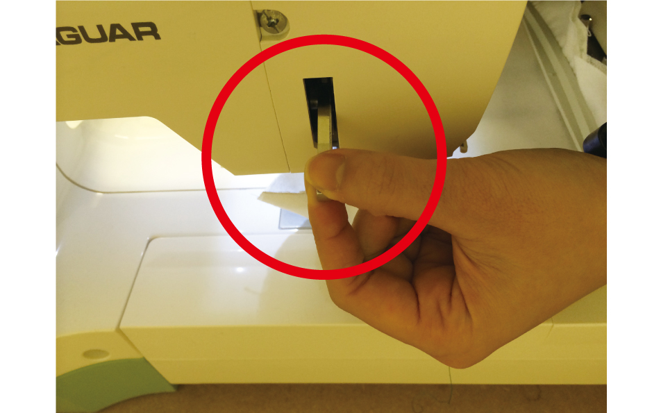

# 05.フレームへの布のセット
  

 
 

テーブルに、写真のように外枠を置きます。 
手前にネジが、左にミシン本体との接続部がくるようにしてください。 
 
 
 

 
 

外枠の上に布を置きます。 
 
 
 

 
 

布の上に内枠を置きます。 
 
 
 

 
 

外枠のネジを締めます。ドライバーを使用して強く締めてください。 
 
 
 

 
 

ネジを締める途中で布を引っ張り、 叩くとポンポンと音がするくらいに調整します。 
また、布を引っ張る際に内枠と外枠の高さがズレないように気をつけてください。 
 
 
 

 
 

押さえ横のレバーを上げながら、刺繍枠をマシンにセットします。 
 
 
 

 
 

枠の突起部を、刺繍器のネジ部にはめ込みます。 
このときに、刺繍器の可動部の位置がずれないよう気をつけてください。 
（可動部が動くと刺繍器内部の制御部が正常に動作しなくなります。） 
 
 
 

 
 

刺繍中に枠がぐらつかないよう、ドライバーでネジをしっかり締めます。 
 
 
 

 
 

ミシン裏の、布押さえを下ろします。以上で刺繍枠のセットは完了です。 
 
 
 
 
 
 
