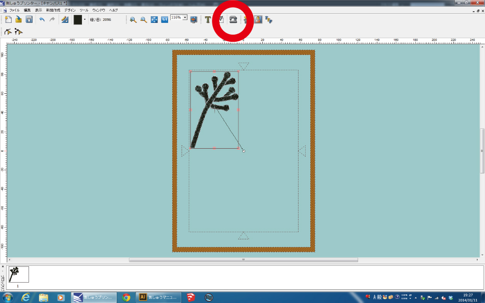
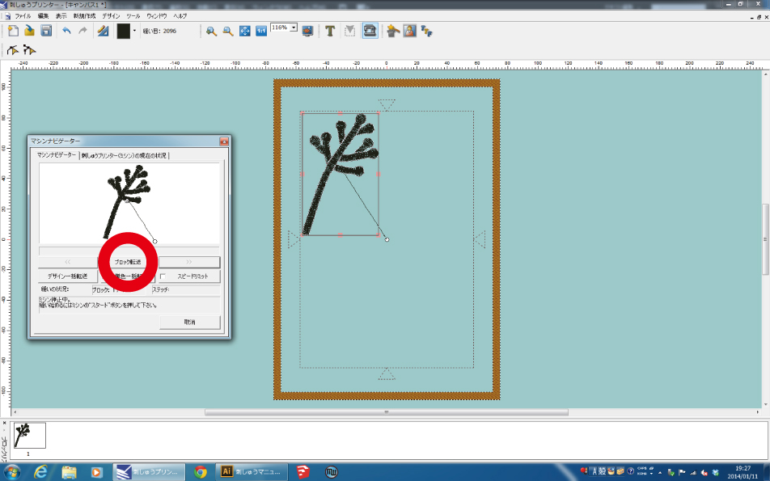
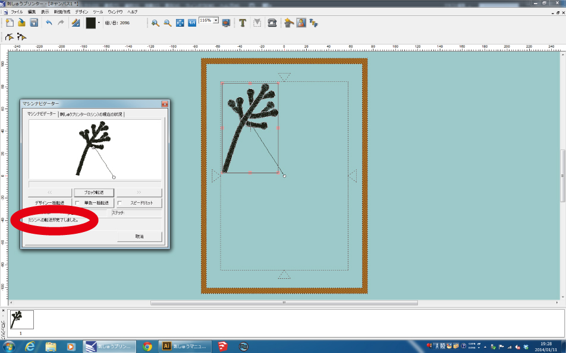
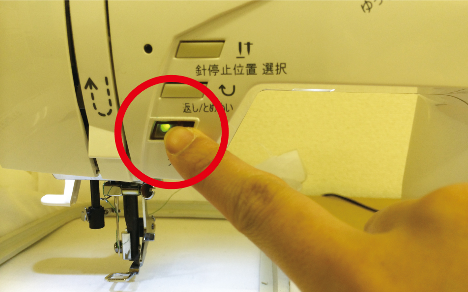
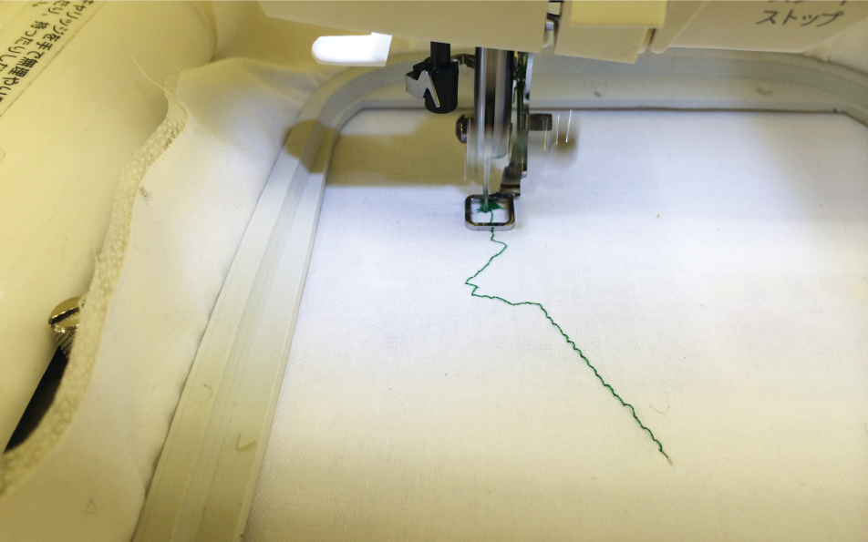
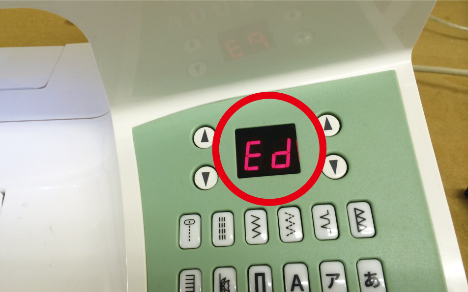

# 06.データ転送〜刺繍開始
  

 
 

刺繍をしたい位置にデータを配置し、ミシンマークを押します。 
 
 
 

 
 

**「ブロック転送」**を押し、ミシンに刺繍データを送ります。 
（このとき**「スピードリミット」**にチェックを入れておくと、加工スピードが抑えめになるので安心です。） 
 
 
 

 
 

**「ミシンへの転送が完了しました。」**と表示され、ミシン本体が動作すればデータ転送が完了です。 
 
 
 

 
 

**「スタート／ストップ」**ボタンを押すと、刺繍が始まります。 
 
 
 

 
 

刺繍が行われます。 
 
 
 

 
 

刺繍が完了すると**「Ed」**という表示が出ます。 
これまでと逆の手順で、ミシン本体から枠や糸を外します。
 
 
 
 
 
 
